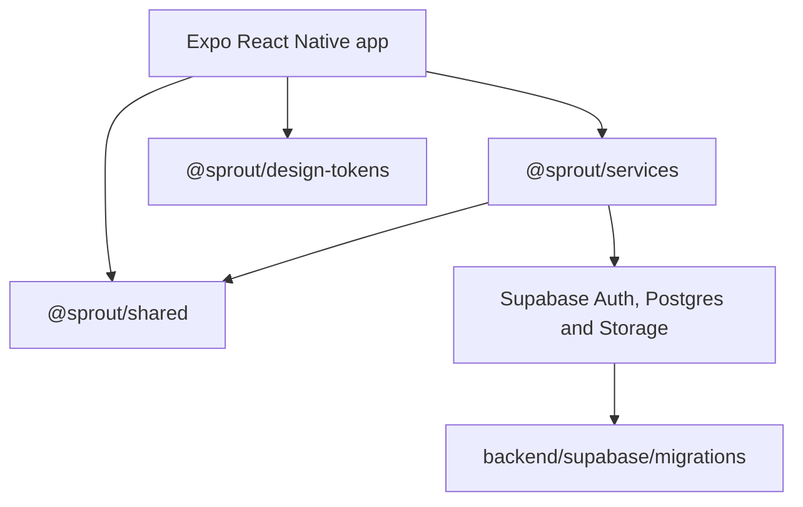
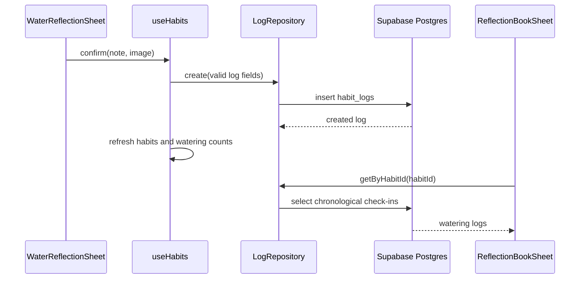

# Sprout Architecture

## Overview

Sprout is an npm-workspaces monorepo containing one Expo React Native application backed by Supabase:

- `apps/mobile`: the supported application for iOS, Android, and Expo web.
- `packages/*`: framework-independent domain rules, service abstractions, Supabase adapters, and design tokens shared across features and supported platforms.
- `backend/supabase`: the PostgreSQL schema, Row Level Security policies, triggers, Storage setup, and migration history.

The application represents habits as plants. Watering a plant creates a habit log; completing a habit moves the plant into the Sanctuary; profiles, friendships, reflections, reactions, comments, and nudges provide the social layer.



## Technology stack

| Area | Technology | Purpose |
| --- | --- | --- |
| Monorepo | npm workspaces | Links applications and internal packages from one dependency graph. |
| Mobile | Expo SDK 57, React Native 0.86, React 19 | Native application runtime and UI. |
| Mobile routing | Expo Router | File-based Stack and Tabs navigation. |
| Mobile graphics | `react-native-svg`, `expo-image` | Reusable plant illustrations, animation layers, and reflection images. |
| Mobile state | React Context and custom hooks | Authentication, services, theme, sync, app lock, and feature state. |
| Mobile persistence | AsyncStorage and SecureStore-backed platform services | Sessions, demo data, cached habits, offline operations, preferences, and lock settings. |
| Backend | Supabase | Authentication, PostgreSQL, PostgREST Data API, Row Level Security, and object storage. |
| Validation | TypeScript and Zod | Static contracts and runtime validation at service boundaries. |
| Testing | Jest, React Native Testing Library, Vitest | Mobile component/repository tests and shared-package tests. |

## Repository layout

```text
Sprout/
├── apps/
│   └── mobile/
│   │   ├── app/                 Expo Router route files and layouts
│   │   └── src/
│   │       ├── components/      Shared native presentation components
│   │       ├── features/        Feature-owned screens, components, hooks and services
│   │       ├── providers/       Application-wide dependency and state providers
│   │       ├── repositories/    Demo-mode repository implementations
│   │       ├── services/        Native platform integrations
│   │       └── utils/           Stateless native utilities
├── packages/
│   ├── shared/                  Domain types, schemas and pure business rules
│   ├── services/                Repository contracts, Supabase adapters and offline sync
│   ├── design-tokens/           Shared colours, spacing, radii and visual constants
│   └── config/                  Shared configuration package
├── backend/
│   └── supabase/
│       ├── migrations/          Ordered remote database migrations
│       ├── tests/               Database contract tests
│       └── storage-policies.sql Hosted Storage policies applied through the Dashboard
└── Sprout-a-detailed-guide.md   Product behaviour and parity reference
```

## Mobile application architecture

### Routing

The `apps/mobile/app` directory is restricted to routes and layouts. Feature implementation lives under `src/features`.

- The root Stack handles authentication and top-level route groups.
- `(auth)` contains login routes.
- `(tabs)` contains Forest, Sanctuary, Buds, Lab, Profile, friend visits, and Wrapped.
- Friend Forest, friend Sanctuary, and Wrapped remain inside the Tabs layout so the bottom navigation remains visible.
- Dynamic friend routes use profile IDs as route parameters.

### Provider composition

The root layout installs providers in dependency order:

```text
AppErrorBoundary
└── GestureHandlerRootView
    └── SafeAreaProvider
        └── ThemeProvider
            └── ServicesProvider
                └── DataProvider
                    └── SyncProvider
                        └── AuthProvider
                            └── AppLockProvider
                                └── Router Stack
```

- `ThemeProvider` owns light/dark appearance and persists the preference.
- `ServicesProvider` is the dependency-injection boundary. It constructs Supabase repositories when environment configuration exists and demo repositories otherwise.
- `DataProvider` exposes a small invalidation revision for cross-feature refreshes.
- `SyncProvider` watches network state and flushes the offline operation queue.
- `AuthProvider` owns Supabase sessions, email/password authentication, and OAuth browser callbacks.
- `AppLockProvider` owns biometric and PIN protection after authentication.

### Feature modules

Each directory under `src/features` owns one product capability. Screens compose UI, hooks own lifecycle and state transitions, and repositories/services perform external operations.

Important feature groups include:

- `habits`: Forest, plant creation, watering, carousel, progress, completion, and reflection notebook.
- `plants`: reusable SVG plant renderers, registry, and plant geometry.
- `sanctuary`: completed plants and reflection interactions.
- `social`: Buds, requests, friend visits, privacy presentation, and nudges.
- `disco`: persistent Disco Plant state, SVG animation, ad/donation reward flow, and energy display.
- `lab`: species discovery and plant simulation.
- `profile`: profile editing, avatar capture/library selection, theme, notifications, and app security.
- `wrapped`: yearly activity summary.

## Shared packages

### `@sprout/shared`

This is the platform-independent domain layer. It has no React Native dependency. It contains:

- TypeScript models such as `Habit`, `HabitLog`, `Profile`, and `Friendship`.
- Create/update input contracts.
- Zod schemas and boundary validation.
- Pure rules for difficulty, progress, watering availability, and date handling.

Business rules should be added here when both applications or multiple services need the same answer.

### `@sprout/services`

This is the data-access layer. High-level features depend on repository interfaces rather than directly importing a configured Supabase client.

It contains:

- Repository interfaces for habits, logs, profiles, social data, interactions, and storage.
- Supabase repository implementations.
- The configured Supabase client factory.
- A persistent offline queue and sync processor.
- Generated/maintained database-facing TypeScript contracts.

The mobile `ServicesProvider` injects these implementations. Demo repositories implement the same interfaces so feature code remains substitutable.

### `@sprout/design-tokens`

This package is the shared source for colours, spacing, border radii, and other stable visual constants. Platform components translate those tokens into React Native styles or web styles as appropriate.

## Data and request flow

For a normal online watering:



Images are uploaded to the `habit-photos` Storage bucket under a folder named with the authenticated user ID. The resulting URL is stored on `habit_logs.image_url`.

## Offline behaviour

Mobile writes that cannot complete are represented as typed sync operations in AsyncStorage.

1. The feature creates a stable client operation ID.
2. A failed or offline operation is added to `PersistentSyncQueue`.
3. `SyncProvider` observes connectivity through NetInfo.
4. `SyncProcessor` uploads pending images, sanitizes database payloads, and retries writes.
5. Successfully synchronized operations are removed; failures retain an error state for another attempt.

`habit_logs.client_operation_id` has a partial unique index, making log retries idempotent and preventing duplicate watering records.

Cached habits allow Forest and Sanctuary to render previously loaded data while the application refreshes from Supabase.

## Supabase architecture

### Authentication

- Supabase Auth is the identity source.
- Google login uses Supabase OAuth, Expo WebBrowser, the `sprout://auth/callback` deep link, and PKCE code exchange.
- `public.profiles.id` references `auth.users.id`.
- A database trigger creates profiles for new Auth users; a migration backfills accounts created before that trigger existed.
- The mobile client uses only the project URL and publishable key. Administrative keys must never be bundled into the application.

### Main tables

| Table | Responsibility |
| --- | --- |
| `profiles` | Public gardener identity linked one-to-one with Auth. |
| `habits` | Plant/habit definition, progress, health, privacy, and completion. |
| `habit_logs` | Watering check-ins, optional notes/images, and idempotency keys. |
| `friendships` | Incoming, outgoing, accepted, and rejected social relationships. |
| `wither_nudges` | Once-per-day nudges for individual withered plants. |
| `log_comments` | Comments attached to watering check-ins. |
| `log_reactions` | Per-user emoji reactions attached to check-ins. |

### Security model

Row Level Security is enabled on application tables.

- Users may create and mutate their own profile, habits, and watering logs.
- Public habit visibility is constrained by habit privacy fields.
- Connected buds may read public habit logs for friends.
- Comments and reactions identify the authenticated author.
- Nudge triggers verify friendship, plant ownership, withered state, and daily uniqueness.
- Storage writes are limited to the authenticated user's folder.

Storage tables are owned by Supabase's managed storage role. Bucket creation is migrated normally, while the policies in `backend/supabase/storage-policies.sql` are applied through the hosted Dashboard.

### Database-driven state transitions

PostgreSQL triggers enforce important invariants regardless of client platform:

- A new habit log advances watering progress and streaks.
- Reaching the target marks a habit completed and records `completed_at`.
- Wither transitions respond to consecutive misses.
- Nudge insertion validates its social and plant-state preconditions.

## Environment configuration

Mobile configuration belongs in `apps/mobile/.env`:

```env
EXPO_PUBLIC_SUPABASE_URL=https://PROJECT_REFERENCE.supabase.co
EXPO_PUBLIC_SUPABASE_PUBLISHABLE_KEY=YOUR_PUBLISHABLE_KEY
```

The custom callback must be allowed in Supabase Auth:

```text
sprout://auth/callback
sprout://**
```

Supabase CLI authentication is separate. `SUPABASE_ACCESS_TOKEN` is an administrative developer credential and must never be placed in an Expo-public variable or committed.

## Development commands

From the repository root:

```powershell
npm run mobile
npm run typecheck
npm run test
npm run validate:mobile
```

Run Expo directly from the mobile workspace when clearing Metro state:

```powershell
cd apps/mobile
npx expo start --clear
```

Apply remote database changes from the backend workspace:

```powershell
cd backend
npx supabase db push
```

## Architectural rules

- Route files perform routing only; feature files own implementation.
- UI components render; custom hooks own lifecycle and stateful orchestration.
- Repositories isolate Supabase and storage details.
- Shared business rules remain pure and platform-independent.
- Inputs are validated at boundaries and outputs honor explicit TypeScript contracts.
- New database fields require a migration and matching shared/service types.
- Reusable plant components and geometry are the visual source of truth across Forest, Sanctuary, Lab, and social visits.
- Avoid direct Supabase calls from screens when a repository abstraction already exists.
- Preserve the product behaviours documented in `Sprout-a-detailed-guide.md` while adapting interactions to native conventions.
