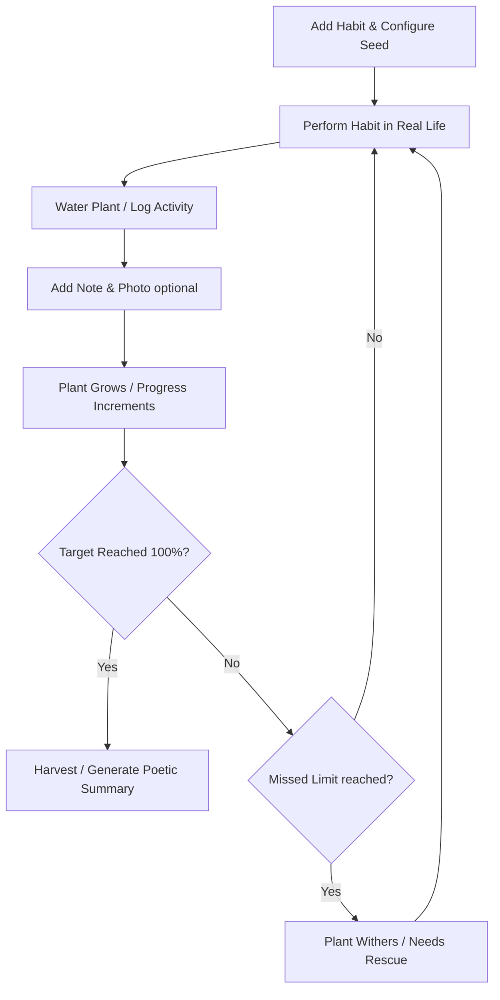

# Sprout: Gamified Habit Tracker & Shared Forests

Welcome to **Sprout**, a social, gamified habit-tracking application designed to help users grow healthy habits alongside their friends. In Sprout, every habit you build is represented by a virtual plant in your personal forest. Every time you complete a habit, you water the plant, helping it grow from a seed into a mature, beautiful tree. You can capture your progress with journal notes and photos, and visit your friends' forests to support their growth.

---

## 1. Product Concept & Gamification

### The Core Loop


### Flexible Habit Rules & Plant Settings
When creating a habit, users define their own commitment schedules and watering targets, granting high flexibility:
* **Target Waterings ($T$)**: The total number of completions required to fully mature the plant (e.g., $30$, $100$, or $365$ waterings).
* **Wither Threshold ($W$)**: The number of consecutive missed intervals a user can commit before the plant goes from "neglected" to the **Withered** state.
* **Custom Frequencies**:
  * **Multi-daily / Daily**: e.g., Water twice a day (Rose) or once a day (Bonsai).
  * **Weekly Flexible**: e.g., "6 out of 7 days" to count as a weekly unit. If the target is met within the sliding 7-day window, the plant gets a growth boost.
  * **Yearly**: e.g., A slow-growing sequoia representing a year-long challenge (such as reading 24 books or running 1000 miles).

### Difficulty-to-Plant Mapping & Aesthetics
The difficulty of a habit determines the rarity and species of the plant. Rarity is calculated based on frequency, target length, and wither strictness:

$$\text{Difficulty Score} = \text{Frequency Multiplier} \times \frac{1}{\text{Wither Threshold}} \times \log(\text{Target Waterings})$$

Based on this score, the app assigns one of four botanical tiers to nurture:

| Difficulty Tier | Plant Species | Visual Theme | Consistency Requirement |
| :--- | :--- | :--- | :--- |
| **Common** | **Pothos / Spider Plant** | Simple, leafy, green. | Low frequency, highly forgiving wither threshold ($W \ge 5$). |
| **Uncommon** | **Bonsai / Lavender / Sunflower** | Colorful, structured. | Daily frequency, moderately forgiving ($W = 3, 4$). |
| **Rare** | **Midnight Rose / Desert Cactus** | Detailed, blooming, unique. | Very high frequency (twice daily) or low wither tolerance ($W = 2$). |
| **Mythical** | **Golden Oak / Ethereal Sakura** | Glimmering, floating petals, gold leaves. | Unforgiving schedule (zero tolerance, $W = 1$). |

### Consistency-Driven Final Visuals
The plant's final look at $100\%$ maturity directly mirrors the history of its growth:
* **Flawless Bloom (0-1 Withers)**: The plant grows perfectly symmetrical, surrounded by a faint glowing aura, fully loaded with vibrant blossoms or rich fruits.
* **Steady Growth (2-3 Withers)**: A standard, healthy, and beautiful mature specimen representing solid, consistent work.
* **Scarred Resilience (4+ Withers)**: The plant matures with slightly asymmetrical branches, a rustic woody trunk, and a few dry golden leaves near the base. It looks battle-tested and uniquely beautiful, reflecting a hard-fought habit.

---

## 2. Completed Tree & Social Features

### The Poetic Journey Summary
Upon reaching $100\%$ maturity, the habit is completed and moved to the user's permanent "Monument Forest." The system analyzes the growth logs (duration, streaks, withered intervals, and rescue times) to write a nostalgic, poetic reflection of the journey. 

#### Examples of Generated Poetic Reflections
* **For a Flawless Bloom (High consistency, 0-1 withers)**:
  > *"Planted in hope, this Ethereal Sakura rose without a single day of drought. Bathed in constant, daily devotion, its shimmering silver branches and floating blossoms stand as a proud, silent monument to your unwavering discipline."*
* **For a Scarred Resilience (Many setbacks, 4+ withers)**:
  > *"Though the soil grew cold and dry in its early seasons, this Midnight Rose refused to fade. It weathered many periods of neglect, yet each time, a patient hand returned to water it. In its rugged wood and asymmetrical bloom, it tells a beautiful story of stubborn persistence over perfection."*
* **For a Slow/Steady Growth (Low/moderate withers, long duration)**:
  > *"Rooted deeply through weeks of change, this Bonsai grew slowly, leaf by leaf. It survived brief periods of thirst only to emerge stronger. Its balanced, winding trunk is a testament to the quiet power of steady, repeated care."*

### Mutual Friendships & Social Feed
Connecting with friends uses a mutual approval model (`pending` $\rightarrow$ `accepted`). Once connected, users can view public trees and interact:
* **Comments & Reactions**: Leave supportive comments and reactions (💧, 👏, ❤️, 🌟) on individual habit logs.
* **Wither Nudges**:
  * If a friend's plant is currently **Withered** (consecutive misses $\ge W$), a **"Send Drop" / "Water Alert"** button appears on their tree.
  * Clicking it sends a notification to the owner's dashboard.
  * **Rate Limit**: Friends can send **only one nudge per withered tree, per calendar day** to prevent notification spam.

### The Yearly Wrapped
An interactive annual summary ("Your Year in the Woods") compiling:
* **The Forest Canopy**: Total seeds planted vs. trees successfully matured.
* **Biomes Explored**: A breakdown of plant tiers grown (Common, Uncommon, Rare, Mythical).
* **Resilience Index**: Average number of days spent in the "Withered" state before reviving.
* **Guardian Angel**: The friend who sent you the most wither notifications/nudges (your accountability partner).
* **Social Echo**: Total comments and reactions received from friends.

---

## 3. Technology Stack & Database Schema

### The Stack
* **Frontend Framework**: **Next.js 14+ (App Router)**.
* **Styling**: **Vanilla CSS / CSS Modules** with CSS variables for responsive theme adjustments.
* **Database & Authentication**: **Supabase (PostgreSQL)**.
* **Asset Storage**: **Supabase Storage** for user-uploaded check-in pictures.

### Database Schema (SQL/PostgreSQL)

```sql
-- Profiles table linked to Supabase Auth users
CREATE TABLE public.profiles (
    id UUID REFERENCES auth.users(id) ON DELETE CASCADE PRIMARY KEY,
    username VARCHAR(50) UNIQUE NOT NULL,
    display_name VARCHAR(100),
    avatar_url TEXT,
    created_at TIMESTAMP WITH TIME ZONE DEFAULT TIMEZONE('utc'::text, NOW()) NOT NULL
);

-- Habits representing individual plants
CREATE TABLE public.habits (
    id UUID DEFAULT gen_random_uuid() PRIMARY KEY,
    user_id UUID REFERENCES public.profiles(id) ON DELETE CASCADE NOT NULL,
    name VARCHAR(100) NOT NULL,
    description TEXT,
    plant_type VARCHAR(50) DEFAULT 'bonsai' NOT NULL,      -- 'rose', 'bonsai', 'pothos', 'cactus', etc.
    difficulty_tier VARCHAR(20) DEFAULT 'common' NOT NULL, -- 'common', 'uncommon', 'rare', 'mythical'
    frequency VARCHAR(20) DEFAULT 'daily' NOT NULL,         -- 'twice_daily', 'daily', 'weekly', 'monthly', 'yearly', 'flexible'
    flexible_rules JSONB,                                   -- e.g., {"days_required": 6, "days_total": 7}
    target_waterings INT DEFAULT 30 NOT NULL,               -- T: target completions for maturity
    current_waterings INT DEFAULT 0 NOT NULL,               -- Current waterings logged
    wither_threshold INT DEFAULT 3 NOT NULL,                -- W: max misses before withering
    consecutive_misses INT DEFAULT 0 NOT NULL,              -- Count of current misses
    wither_count INT DEFAULT 0 NOT NULL,                    -- Total times withered during growth
    status VARCHAR(20) DEFAULT 'healthy' NOT NULL,          -- 'healthy', 'withered', 'completed'
    poetic_summary TEXT,                                    -- Nostalgic summary generated at completion
    is_public BOOLEAN DEFAULT true NOT NULL,
    current_streak INT DEFAULT 0 NOT NULL,
    max_streak INT DEFAULT 0 NOT NULL,
    completed_at TIMESTAMP WITH TIME ZONE,
    created_at TIMESTAMP WITH TIME ZONE DEFAULT TIMEZONE('utc'::text, NOW()) NOT NULL
);

-- Habit completion logs
CREATE TABLE public.habit_logs (
    id UUID DEFAULT gen_random_uuid() PRIMARY KEY,
    habit_id UUID REFERENCES public.habits(id) ON DELETE CASCADE NOT NULL,
    completed_at TIMESTAMP WITH TIME ZONE DEFAULT TIMEZONE('utc'::text, NOW()) NOT NULL,
    note TEXT,
    image_url TEXT, -- Path to Supabase Storage file
    created_at TIMESTAMP WITH TIME ZONE DEFAULT TIMEZONE('utc'::text, NOW()) NOT NULL
);

-- Comments on habit logs
CREATE TABLE public.log_comments (
    id UUID DEFAULT gen_random_uuid() PRIMARY KEY,
    log_id UUID REFERENCES public.habit_logs(id) ON DELETE CASCADE NOT NULL,
    user_id UUID REFERENCES public.profiles(id) ON DELETE CASCADE NOT NULL,
    content TEXT NOT NULL,
    created_at TIMESTAMP WITH TIME ZONE DEFAULT TIMEZONE('utc'::text, NOW()) NOT NULL
);

-- Reactions on habit logs
CREATE TABLE public.log_reactions (
    id UUID DEFAULT gen_random_uuid() PRIMARY KEY,
    log_id UUID REFERENCES public.habit_logs(id) ON DELETE CASCADE NOT NULL,
    user_id UUID REFERENCES public.profiles(id) ON DELETE CASCADE NOT NULL,
    reaction_type VARCHAR(20) NOT NULL, -- 'droplet', 'clap', 'heart', 'star'
    created_at TIMESTAMP WITH TIME ZONE DEFAULT TIMEZONE('utc'::text, NOW()) NOT NULL,
    UNIQUE (log_id, user_id, reaction_type)
);

-- Friendships table (mutual model)
CREATE TABLE public.friendships (
    id UUID DEFAULT gen_random_uuid() PRIMARY KEY,
    user_id UUID REFERENCES public.profiles(id) ON DELETE CASCADE NOT NULL, -- requester
    friend_id UUID REFERENCES public.profiles(id) ON DELETE CASCADE NOT NULL, -- receiver
    status VARCHAR(20) DEFAULT 'pending' NOT NULL, -- 'pending', 'accepted'
    created_at TIMESTAMP WITH TIME ZONE DEFAULT TIMEZONE('utc'::text, NOW()) NOT NULL,
    UNIQUE (user_id, friend_id),
    CONSTRAINT friendship_no_self_link CHECK (user_id <> friend_id)
);

-- Wither notifications / Nudges (once per day per friend, per withered tree)
CREATE TABLE public.wither_nudges (
    id UUID DEFAULT gen_random_uuid() PRIMARY KEY,
    sender_id UUID REFERENCES public.profiles(id) ON DELETE CASCADE NOT NULL,
    receiver_id UUID REFERENCES public.profiles(id) ON DELETE CASCADE NOT NULL,
    habit_id UUID REFERENCES public.habits(id) ON DELETE CASCADE NOT NULL,
    nudged_at DATE DEFAULT CURRENT_DATE NOT NULL,
    created_at TIMESTAMP WITH TIME ZONE DEFAULT TIMEZONE('utc'::text, NOW()) NOT NULL,
    UNIQUE (sender_id, habit_id, nudged_at)
);
```

---

## 4. UI/UX Design System

### Color Palette (Cozy Forest Theme)
* **Backgrounds**: Soft sage green (`#F4F7F5`), warm sand (`#FAF7F2`), and deep evergreen (`#1B3B2B`).
* **Accents**: Forest Green (`#2D5A27`), Blooming Petal Pink (`#EAA89B`), and Sunlight Amber (`#EAA89B`).
* **UI Elements**: Glassmorphic panels with soft drop shadows.

### Interactive Social Components
* **Dynamic Plant Growth Visualization**:
  * Plants are animated via custom layered SVGs.
  * The growth percentage (`current_waterings` / `target_waterings`) scales the SVG element size and reveals new details.
  * If `wither_count > 3`, the mature plant SVG renders slightly askew or with different color leaves.
* **Social Activity Feed**: Displays completions, log pictures, and comments.
* **Nudge Button**: Rendered only when visiting a friend's forest and viewing a plant with `status = 'withered'`. Includes the daily throttling message if clicked again.

---

## 5. Development Roadmap

### Phase 1: Core Habit & Dynamic Growth (V1)
* Set up Next.js app structure, Vanilla CSS grid design system.
* CRUD functionality for Habits with custom frequency selection (including weekly flexible and yearly rules) and customizable targets ($T$, $W$).
* Basic check-in feature (watering button) that saves logs to `habit_logs`.

### Phase 2: Rich Logging & Image Storage (V2)
* Setup Supabase Storage buckets for image uploads.
* Build log-entry dialog supporting description and photo attachment.
* Local timeline display of habit logs.

### Phase 3: Friendships, Comments, & Reactions (V3)
* Profiles and friendship routing (mutual request & accept status).
* Log interactions: ability to leave reactions and write comments on friend's timeline logs.
* Visitor forest dashboard showing friends' public trees.

### Phase 4: Wither, Nudge, Poetic Reflection & Yearly Wrapped (V4)
* Implement Wither state detection and Wither Nudges trigger limiting friends to one nudge/day per withered tree.
* Implement the Poetic Summary generator on habit completion.
* Create the Yearly Wrapped statistics query engine and dashboard view.
* Add SVG-based plant assets for each growth stage and animations (watering, swaying, leaf wilting).
